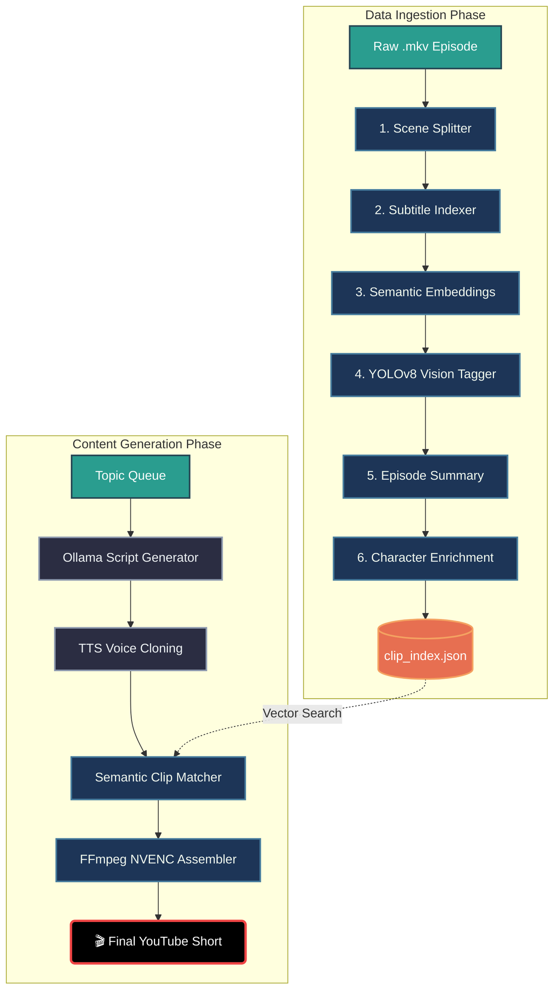
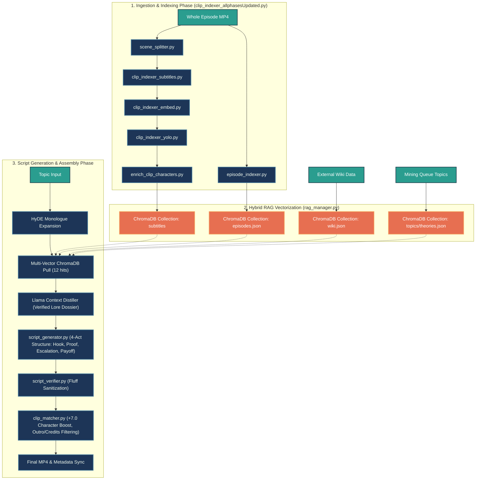
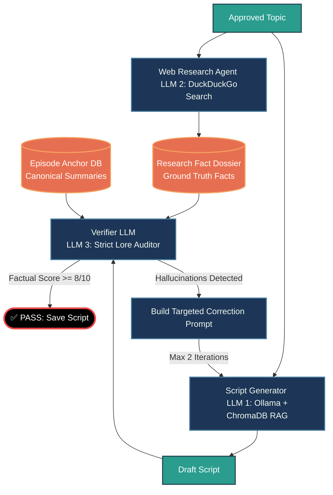
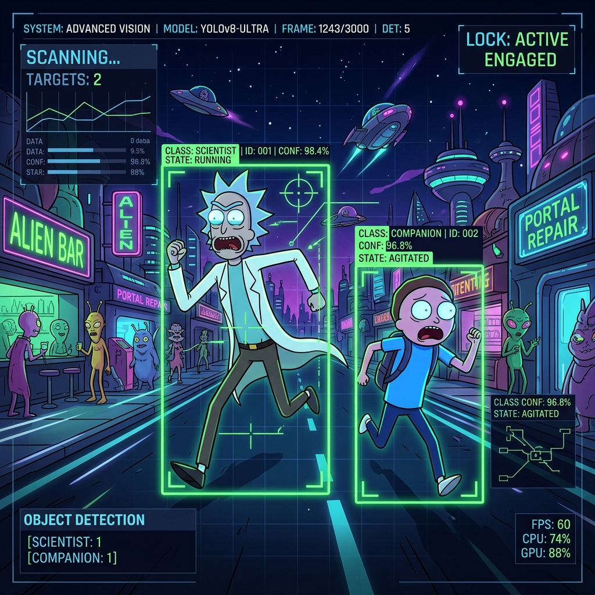

<div align="center">
  

  # 🤖 Automated YouTube Shorts AI Pipeline
  
  [](#)
  [](#)
  [](#)
  [](#)
  [](#)

  **A fully automated, AI-driven pipeline that converts long-form video episodes into highly engaging, auto-captioned, and character-tagged YouTube Shorts.**
</div>

---

## 🌟 Overview

This repository houses an advanced video automation pipeline designed to curate and render short-form content at scale. By leveraging computer vision and natural language processing, the system intelligently identifies scenes, extracts dialogue, semantically maps conversations, and spatially tags characters on screen—all before rendering the final hardware-accelerated video.

### 🧠 Core Capabilities & AI Stack
- **Intelligent Scene Splitting:** Uses `PySceneDetect` (via OpenCV) to analyze frame differences and losslessly cut full-length episodes exactly on camera cuts.
- **Dialogue Extraction:** A custom matching algorithm cross-references `.srt` subtitle files with scene timecodes to perfectly assign the exact spoken dialogue to each micro-clip.
- **Semantic Vibe-Search:** Uses Hugging Face's `clip-ViT-B-32` model to create dense 512-dimensional vector embeddings of the dialogue. This allows the orchestrator to dynamically pull clips based on abstract concepts, "vibes", or topics.
- **Computer Vision Character Recognition:** Employs a custom-trained **YOLOv8** model running on PyTorch to scan frames and tag which characters (e.g., Rick, Morty, Summer) are physically present in the scene.
- **Hardware-Accelerated Rendering:** Powered by FFmpeg with NVIDIA NVENC support (`h264_nvenc`) to assemble, crop, and render 1080p Shorts natively on the GPU, dropping render times from minutes to seconds.

---

## 🏛️ Master Architecture

The VibeCodingMax ecosystem is divided into two highly automated subsystems: **Data Ingestion** (building the AI's memory) and **Content Generation** (the Orchestrator). 

All extracted metadata is continuously funneled into a central `clip_index.json` database, which serves as the "brain" for the automated editor.



---

## 🔍 Deep Dive: Complete System Architecture

For a more granular look at the exact scripts, ChromaDB collections, and logic flows, here is the expanded architecture:



---

## 🤖 Multi-Agent LLM Workflow

This pipeline utilizes an interconnected network of specialized agents to ensure factual accuracy and high engagement:



---

## 📁 Repository Structure

```text
📦 VibeCodingMax
├── 📁 assets/                 # UI assets, fonts, and graphical banners
├── 📁 clips/                  # Raw episode MP4s and split scene chunks
├── 📁 output/                 # Final rendered NVENC hardware-accelerated videos
├── 📁 scripts/                # Core AI pipeline python scripts
├── 📁 topics/                 # Queue JSON and approved topic theories
├── 📁 yolo_wt/                # YOLOv8 custom trained model weights for characters
├── 📄 clip_index.json         # Master Semantic Vector Database
├── 📄 config.yaml             # Global pipeline configuration
├── 📄 show_config.yaml        # Character aliases and Show-specific metadata
└── 📄 README.md               # Documentation
```

---

## 🚀 The Automated Pipeline

### Phase 1: Ingestion & Indexing (`clip_indexer_allphasesUpdated.py`)


Instead of running manual scripts, the entire episode ingestion sequence has been streamlined into a single master script with smart caching and CPU/GPU fallback optimizations.

- **`scene_splitter.py`**: Uses computer vision to analyze frames and losslessly cut full-length episodes exactly on camera cuts. Automatically skips if clips already exist to save time.
- **`clip_indexer_subtitles.py`**: Cross-references `.srt` subtitle files with scene timecodes to perfectly assign spoken dialogue to each micro-clip.
- **`clip_indexer_embed.py`**: Uses Hugging Face's `SentenceTransformers` (running highly optimized on CPU to prevent hardware mismatches) to create dense vector embeddings of the dialogue.
- **`clip_indexer_yolo.py`**: A custom-trained YOLOv8 object detection model physically opens every video clip to detect which characters (e.g., Rick, Morty) are on screen.
- **`enrich_clip_characters.py`**: A secondary NLP pass that scans subtitles for hidden character aliases, updating the database and selectively re-embedding only modified clips.
- **`episode_indexer.py`**: Uses a local Ollama LLM to generate a canonical summary of the episode for metadata tracking.

```powershell
.\venv\Scripts\python scripts/clip_indexer_allphasesUpdated.py --episode "clips/S7/E1/video.mkv" --show rick_and_morty
```

---

### Phase 2: Hybrid RAG Vectorization (`rag_manager.py`)

The system transforms raw ingested data into an interconnected Retrieval-Augmented Generation (RAG) network using ChromaDB. This allows the LLM agents to cross-reference multiple domains of knowledge instantly.

- **Subtitle Collection**: Embeds the exact dialogue spoken by characters across every ingested episode.
- **Episode Collection**: Indexes the canonical summaries and overarching plots of each episode.
- **Wiki Collection**: Pulls in external fandom wiki data to ground the AI in absolute canonical lore.
- **Theories Collection**: Maps out abstract concepts and fan theories for generating viral hooks.

---

### Phase 3: Script Generation & Assembly (`process_queue.py`)

Once the RAG database is populated, the `process_queue.py` orchestrator autonomously generates content based on the `queue.json` topics.

1. **HyDE Monologue Expansion**: Takes your simple input topic and artificially expands it into a hypothetical script to drastically improve semantic search matching.
2. **Multi-Vector ChromaDB Pull**: The system hits all 4 ChromaDB collections simultaneously, returning the top 12 most mathematically relevant hits.
3. **Llama Context Distiller**: Condenses the raw vectors into a highly-dense "Verified Lore Dossier" of ground truths.
4. **`script_generator.py`**: LLM 1 utilizes a strict 4-Act structure (Hook, Proof, Escalation, Payoff) to write the script.
5. **`script_verifier.py`**: LLM 3 (the Strict Lore Auditor) scans the draft script for fluff or hallucinations. If it detects an error, it bounces the script back for correction.
6. **`clip_matcher.py`**: Queries the video database using semantic similarity, applying a massive `+7.0` score boost to clips containing the correct YOLO character tags while filtering out intro/outro sequences.
7. **Final NVENC Assembly**: Hands the matched clips to `assembler.py` to resize to 9:16, burn in dynamic captions, and use FFmpeg `h264_nvenc` to render the final 1080p video natively on the GPU in seconds.

---

## ⚙️ Hardware Requirements
- **OS:** Windows 11
- **GPU:** NVIDIA RTX 5060 (or better) with up-to-date Game Ready or Studio Drivers. (CUDA acceleration heavily utilized across the stack).
- **Dependencies:** FFmpeg must be installed globally and added to the System PATH with `h264_nvenc` support.

---
<div align="center">
<i>Built with ☕ and ❤️ for Automated Content Creation.</i>
</div>
