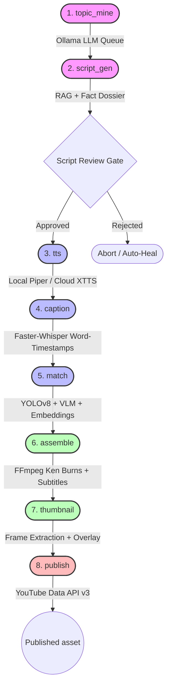

<div align="center">
  

  # 🤖 Autonomous AI Content Automation Pipeline
  
  **An enterprise-grade, 8-phase neural content production engine featuring self-correcting RAG verification, multi-modal computer vision indexing, and fault-tolerant state orchestration.**

  [](https://www.python.org/)
  [](https://ollama.ai/)
  [](https://www.trychroma.com/)
  [](https://github.com/ultralytics/ultralytics)
  [](https://ffmpeg.org/)
  [](https://developers.google.com/youtube/v3)
</div>

---

## 📌 Executive Summary (Recruiter TL;DR)

This repository houses a **compound AI engineering system** designed to solve the reliability, grounding, and workflow bottlenecks of generative video production. While standard AI demos rely on fragile, single-shot `model.generate()` scripts, this engine decouples generation into an **idempotent, 8-phase state machine** capable of taking raw thematic concepts and autonomously deploying fully edited, fact-checked, caption-burned 1080p video assets to YouTube.

### 🌟 Core Engineering Differentiators

| Dimension | Standard AI Demos | This Pipeline |
| :--- | :--- | :--- |
| **Execution Architecture** | Fragile monolithic scripts | **Decoupled 8-Phase State Machine** with JSON persistence |
| **Factuality & Grounding** | Blind generation (High hallucination) | **Closed-loop Verifier LLM** cross-checking RAG vs. live web dossiers |
| **Visual Asset Retrieval** | Basic filename/keyword regex | **Multi-Modal CV Fusion** (Fine-tuned YOLOv8 + LLaVA Vision + NLP Embeddings) |
| **Compute Strategy** | Locked to local hardware or 100% API | **Hybrid Local/Cloud Offloading** (Local pipeline + Colab GPU XTTS synthesis) |
| **Disaster Recovery** | Crashes require complete restart | **Sub-second Resume-on-Interrupt** from exact failure checkpoint |

---

## 🏗️ System Architecture & Workflow

The pipeline is split into two massive phases: **Data Ingestion** (Steps 1-4) and **Video Generation** (The Orchestrator). All extracted metadata is continuously funneled into a central `clip_index.json` database, which serves as the "brain" for the automated editor.

The pipeline runs sequentially across 8 distinct architectural boundaries. If interrupted by rate limits, hardware blips, or manual review gates, execution hydrates cleanly from `pipeline_state.json`.



---

## 🧠 Core Innovation: The Verifier-Corrector Loop

To prevent large language models from fabricating plot points or misattributing canonical lore, **Phase 1b (`script_gen`)** implements an autonomous agentic fact-checking loop before any media rendering begins.

1. **Web Grounding**: A research subagent pulls live discussions, wiki updates, and community consensus into a structured `Research Dossier`.
2. **Canonical Anchoring**: Queries `ChromaDB` vector stores containing 200+ canonical episode transcripts.
3. **Lore Auditing**: An independent Verifier LLM audits every factual claim in the generated script against both the external dossier and local database. Any discrepancy triggers a targeted correction prompt.

---

## 👁️ Multi-Modal Visual Indexing Engine

Matching narration text to video B-roll at scale requires understanding video clips across multiple semantic layers. **Phase 5 (`match`)** utilizes a hybrid retrieval strategy:

* **Object & Character Level (`YOLO_finetuning.py`)**: Custom fine-tuned **YOLOv8** models detect specific character bounding boxes and screen presence across thousands of raw video frames.
* **Semantic & Action Level (`clip_indexer_vision.py`)**: Local Vision-Language Models (**LLaVA** via Ollama) analyze middle-frame extractions to index scene lighting, character actions, and physical environments.
* **Dialogue Level (`episode_indexer.py`)**: Subtitle files are parsed into 384-dimensional sentence embeddings to anchor clips to canonical episode plotlines.

When drafting the assembly manifest, the decision engine calculates a composite similarity score to pair narration chunks with the mathematically optimal clip.

---

## 🛡️ Fault-Tolerant State Machine

Generative video pipelines are inherently volatile: API sockets drop, local GPUs overheat, and user interruptions occur. Instead of wrapping code in generic `try/except` blocks, the orchestrator maintains a persistent ledger (`pipeline_state.json`). 

* **Zero Work Loss**: Running `python scripts/orchestrator.py --resume` reads the ledger and jumps execution directly to the next phase.
* **Cloud Offloading**: If local hardware lacks the VRAM for high-end voice synthesis, the state machine cleanly pauses execution, prompts the operator to execute cloud notebooks, ingests the resulting artifacts, and resumes local assembly.

---

## 📂 Repository Structure

```text
├── 📁 config/                 # YAML configuration definitions (Models, API endpoints, thresholds)
├── 📁 notebooks/              # GPU Colab notebooks for cloud-offloaded XTTS voice synthesis
├── 📁 prompts/                # System prompts for Topic Miner, Script Verifier, and RAG agents
├── 📁 scripts/                # Core modular execution engine
│   ├── orchestrator.py        # Master 8-phase pipeline controller & state ledger manager
│   ├── topic_miner.py         # Phase 1a: Autonomous topic ideation queue manager
│   ├── script_generator.py    # Phase 1b: RAG-augmented script drafting engine
│   ├── web_researcher.py      # Fact dossier compiler via search APIs
│   ├── script_verifier.py     # Closed-loop fact-checking auditor loop
│   ├── tts_local.py           # Phase 2: Local neural voice synthesis (Piper TTS)
│   ├── captioner.py           # Phase 3: Faster-Whisper word-level timestamp extraction
│   ├── clip_matcher.py        # Phase 4: Multi-modal visual assembly manifest builder
│   ├── assembler.py           # Phase 5: Subprocess FFmpeg hardware video compositor
│   ├── thumbnail_generator.py # Phase 6: Computer vision frame ranker & thumbnail renderer
│   ├── publisher.py           # Phase 7: YouTube Data API v3 OAuth upload controller
│   ├── YOLO_finetuning.py     # Custom YOLOv8 training pipeline for character detection
│   └── clip_indexer_vision.py # LLaVA local VLM automated scene tagger
├── 📁 vector_db/              # Persistent ChromaDB vector collections
└── README.md                  # System documentation
```

---

## 🚀 Quickstart Guide

### 1. Environment Installation

```bash
# Clone repository
git clone https://github.com/ankush-10010/AutomationPipeline.git
cd AutomationPipeline

# Install Python dependencies
pip install -r requirements.txt

# Verify local hardware dependencies
ffmpeg -version
ollama list
```

### 2. Pipeline Execution Modes

```bash
# Run complete autonomous production pipeline from a custom concept
python scripts/orchestrator.py --topic "Why Rick's Portal Gun Changes Everything"

# Execute autonomous batch mining & run pipeline on top queued item
python scripts/orchestrator.py --phase topic_mine --count 5
python scripts/orchestrator.py --phase all --auto-approve

# Recover from an unexpected hardware shutdown or API rate limit
python scripts/orchestrator.py --resume
```

---

## 📥 How It Works: The Ingestion Phase

To ingest a new full-length episode into the AI's "memory", activate your virtual environment and run the pipeline sequence below:

### Step 1: Chop the Episode into Scenes
The first step is completely breaking down a 20-minute episode into usable, bite-sized components. `scene_splitter.py` analyzes the pixels of every frame to detect camera angle changes, and triggers an FFmpeg cut. 
- **Output:** Hundreds of perfectly cut `.mp4` scene files saved into a `split_clips` folder, along with a JSON manifest of their exact timestamps.
```powershell
.\venv\Scripts\python scripts/scene_splitter.py "clips/rick_and_morty/Episode/episode.mkv" --output "clips/rick_and_morty/" --prefix "s5e6"
```

### Step 2: Auto-Tag Subtitles (Database Creation)
This script reads the master subtitle `.srt` file, compares it to the timecodes from Step 1, and assigns the text to the correct video clip.
- **Output:** The clips are officially registered into the master `clip_index.json` database.
```powershell
.\venv\Scripts\python scripts/clip_indexer_subtitles.py --manifest "clips/rick_and_morty/Episode/split_clips/manifest.json" --srt "subtitles/episode.srt" --show "rick_and_morty"
```

### Step 3: Generate Semantic Embeddings (NLP)
A massive upgrade to the database. The AI reads the dialogue assigned to every single clip and runs it through a Hugging Face `SentenceTransformer` model. 
- **Output:** It appends a massive mathematical array (an embedding) to the database for every clip.
```powershell
.\venv\Scripts\python scripts/clip_indexer_embed.py
```

### Step 4: YOLO Vision Tagging (Computer Vision)


Finally, the script loads a specialized YOLOv8 object detection model to physically open every single video clip and detect which characters are on screen.
```powershell
.\venv\Scripts\python scripts/clip_indexer_yolo.py --weights yolo_wt/20epochs.pt
```

---

## ⚙️ Hardware Requirements
- **OS:** Windows 11
- **GPU:** NVIDIA RTX 3060/4060/5060 (or better) with up-to-date Game Ready or Studio Drivers. (CUDA acceleration heavily utilized across the stack).
- **Dependencies:** FFmpeg must be installed globally and added to the System PATH with `h264_nvenc` support.

---
<div align="center">

*Designed & Architected for High-Reliability Generative Media Workflows.*

*Built with ☕ and ❤️ for Automated Content Creation.*

</div>
