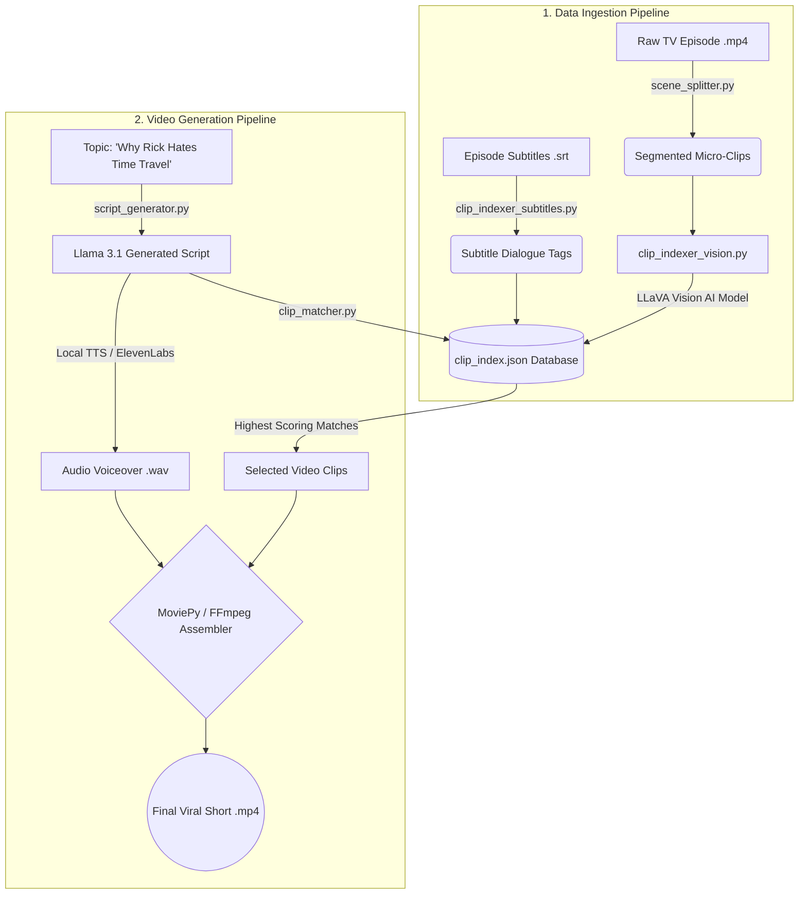

<div align="center">
  
  <h1>🎬 VibeCodingMax: The YT Automation AI Pipeline</h1>
  
  <p>An end-to-end AI-powered orchestration pipeline that autonomously slices long-form TV episodes into highly engaging, context-aware short-form content for YouTube Shorts, TikTok, and Instagram Reels.</p>

  
  
  
  
  
</div>

---

## 🌟 Overview

Welcome to the ultimate automated content factory. This pipeline doesn't just cut random clips and stitch them together; it actually **"watches"** and **"reads"** the episodes to build a highly intelligent, searchable video database. 

When you provide a topic (e.g., *"Evil Morty's Master Plan"*), the AI:
1. Writes a viral, lore-accurate script.
2. Generates an emotional AI voiceover.
3. Semantically searches the database for visually and contextually perfect video clips to match the narration.
4. Stitches the video, audio, and captions into a polished `.mp4` ready for upload.

---

## 🧠 System Architecture

The project is split into two distinct pipelines: **Ingestion** (building the brain) and **Orchestration** (generating the video).



---

## ✨ Key Features

| Feature | Description |
| :--- | :--- |
| **🎞️ Intelligent Splitting** | Uses advanced heuristics to slice full-length episodes into hundreds of perfectly timed micro-clips without awkwardly cutting off mid-scene. |
| **📝 Context Mapping** | Maps official `.srt` subtitle dialogue directly to specific clips, allowing the AI to understand exactly what is being said in every video file. |
| **👁️ Local Vision AI** | Wakes up local Vision-Language Models (like Ollama/LLaVA) to physically "watch" the center frame of every clip and tag the characters, actions, and locations. |
| **🧠 Lore-Accurate Scripts** | Feeds deep lore and show context into an LLM (Llama 3.1) to generate engaging, viral-ready scripts that sound like a true fan wrote them. |
| **🎙️ Flexible TTS Engines** | Supports local GPU-accelerated Text-to-Speech models (XTTS, Piper), Google Colab offloading, and ElevenLabs API integration for premium voice acting. |

---

## 📂 Repository Structure

```text
YT_Automation_AI/
├── clips/                 # Stored micro-clips and manifest files
├── episodes/              # Raw full-length episode files and .srt subtitles
├── notebooks/             # Google Colab notebooks for heavy GPU offloading
├── output/                # Rendered final MP4 videos ready for upload
├── scripts/               # Core pipeline Python scripts (Splitter, Indexer, etc.)
├── topics/                # LLM generated scripts and pure text narrations
├── clip_index.json        # The central brain: JSON database of all tagged clips
├── pipeline_state.json    # State manager allowing the pipeline to pause/resume
└── requirements.txt       # Python dependencies
```

---

## ⚙️ The 3-Step Ingestion Guide

Before generating videos, raw episodes must be ingested into the AI's brain (`clip_index.json`). Do this for every new episode you download.

### 1. Split the Episode
Chops the raw `.mp4` into hundreds of bite-sized scenes.
```bash
python scripts/scene_splitter_local.py "clips/rick_and_morty/s9e1.mp4" --output "clips/rick_and_morty/split_clips" --prefix "s9e1"
```

### 2. Index Subtitles
Embeds the dialogue from the `.srt` file into the clip database so clips can be found via quotes.
```bash
python scripts/clip_indexer_subtitles.py --manifest "clips/rick_and_morty/split_clips/s9e1_manifest.json" --srt "episodes/s9e1.srt" --show rick_and_morty
```

### 3. Vision Auto-Tagging
Wakes up the Vision AI to visually tag all new clips with characters, moods, and actions.
```bash
python scripts/clip_indexer_vision.py --clips-dir "clips/rick_and_morty/split_clips"
```

---

## 🚀 Generating a Video

Once your clip library is indexed, creating a video takes a single command. The pipeline handles everything else autonomously!

```bash
python scripts/orchestrator_noImage_gpuVoice.py --topic "Evil Morty's Master Plan"
```

> **💡 Tip:** If the pipeline pauses for Google Colab TTS generation, simply generate your audio, drop the `.wav` into the `audio/` folder, and run `python scripts/orchestrator_noImage_gpuVoice.py --resume`.

---

<div align="center">
  <i>Built to automate the grind so you can focus on the creative vision.</i>
</div>
