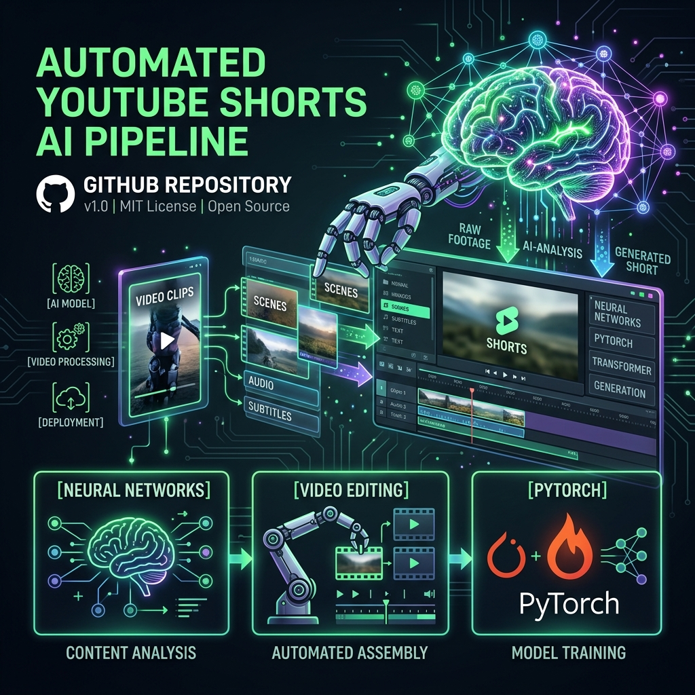
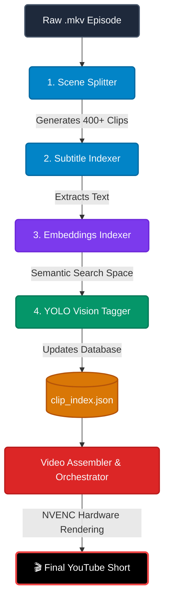

<div align="center">
  

  # 🤖 Automated YouTube Shorts AI Pipeline
  
  [](#)
  [](#)
  [](#)
  [](#)
  [](#)

  **A fully automated, AI-driven pipeline that converts long-form video episodes into highly engaging, auto-captioned, and character-tagged YouTube Shorts.**
</div>

---

## 🌟 Overview

This repository houses an advanced video automation pipeline designed to curate and render short-form content at scale. By leveraging computer vision and natural language processing, the system intelligently identifies scenes, extracts dialogue, semantically maps conversations, and spatially tags characters on screen—all before rendering the final hardware-accelerated video.

### 🧠 Core Capabilities
- **Intelligent Scene Splitting:** Uses `PySceneDetect` to losslessly cut full-length episodes into hundreds of perfect, context-aware micro-clips.
- **Dialogue Extraction:** Maps `.srt` subtitle files directly to generated clips to capture exact conversational context.
- **Semantic Vibe-Search:** Uses Hugging Face's `clip-ViT` models to create dense vector embeddings of every scene, allowing you to search your video database by "vibe" or specific topics.
- **Character Recognition:** Employs a custom-trained **YOLOv8** model to automatically tag which characters (e.g., Rick, Morty, Summer) are actively present in any given scene.
- **Hardware-Accelerated Rendering:** Powered by FFmpeg with NVIDIA NVENC support (`h264_nvenc`) to assemble and render 1080p Shorts natively on the GPU in seconds.

---

## 🛠️ Pipeline Architecture

The pipeline processes raw video through a sequence of 4 specialized indexing scripts, followed by a rendering orchestrator.



---

## 🚀 Usage Guide

To process a new episode, activate your virtual environment and run the pipeline sequence below:

### Step 1: Chop the Episode into Scenes
Cuts the main video into individual scene clips based on camera cuts.
```powershell
.\venv\Scripts\python scripts/scene_splitter.py "clips/rick_and_morty/Episode/episode.mkv" --output "clips/rick_and_morty/" --prefix "s5e6"
```
*(The script will automatically cluster the output into a tidy `split_clips` folder inside your Episode directory!)*

### Step 2: Auto-Tag Subtitles
Cross-references the generated video clips with the master subtitle file to perfectly extract dialogue into `clip_index.json`.
```powershell
.\venv\Scripts\python scripts/clip_indexer_subtitles.py --manifest "clips/rick_and_morty/Episode/split_clips/manifest.json" --srt "subtitles/episode.srt" --show "rick_and_morty"
```

### Step 3: Generate Semantic Embeddings
Runs the NLP model to vectorize all extracted text, enabling AI-powered semantic search. *(Note: Force PyTorch to CPU if your RTX 5060 hits architecture limits).*
```powershell
$env:CUDA_VISIBLE_DEVICES="-1"
.\venv\Scripts\python scripts/clip_indexer_embed.py
```

### Step 4: YOLO Vision Tagging
Runs the YOLOv8 computer vision model to scan every frame of the clips and tag the characters present.
```powershell
.\venv\Scripts\python scripts/clip_indexer_yolo.py --weights yolo_wt/20epochs.pt
$env:CUDA_VISIBLE_DEVICES=""
```

---

## ⚙️ Hardware Requirements
- **OS:** Windows 11
- **GPU:** NVIDIA RTX 5060 (or better) with up-to-date Game Ready or Studio Drivers.
- **Dependencies:** FFmpeg must be installed and added to the System PATH with `h264_nvenc` support.

---
<div align="center">
<i>Built with ☕ and ❤️ for Automated Content Creation.</i>
</div>
