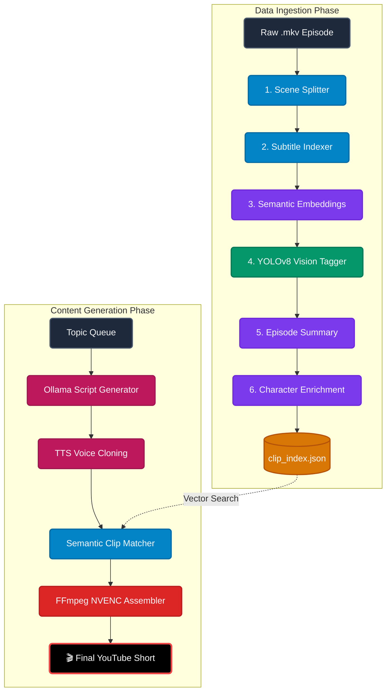

<div align="center">
  

  # 🤖 Automated YouTube Shorts AI Pipeline
  
  [](#)
  [](#)
  [](#)
  [](#)
  [](#)

  **A fully automated, AI-driven pipeline that converts long-form video episodes into highly engaging, auto-captioned, and character-tagged YouTube Shorts.**
</div>

---

## 🌟 Overview

This repository houses an advanced video automation pipeline designed to curate and render short-form content at scale. By leveraging computer vision and natural language processing, the system intelligently identifies scenes, extracts dialogue, semantically maps conversations, and spatially tags characters on screen—all before rendering the final hardware-accelerated video.

### 🧠 Core Capabilities & AI Stack
- **Intelligent Scene Splitting:** Uses `PySceneDetect` (via OpenCV) to analyze frame differences and losslessly cut full-length episodes exactly on camera cuts.
- **Dialogue Extraction:** A custom matching algorithm cross-references `.srt` subtitle files with scene timecodes to perfectly assign the exact spoken dialogue to each micro-clip.
- **Semantic Vibe-Search:** Uses Hugging Face's `clip-ViT-B-32` model to create dense 512-dimensional vector embeddings of the dialogue. This allows the orchestrator to dynamically pull clips based on abstract concepts, "vibes", or topics.
- **Computer Vision Character Recognition:** Employs a custom-trained **YOLOv8** model running on PyTorch to scan frames and tag which characters (e.g., Rick, Morty, Summer) are physically present in the scene.
- **Hardware-Accelerated Rendering:** Powered by FFmpeg with NVIDIA NVENC support (`h264_nvenc`) to assemble, crop, and render 1080p Shorts natively on the GPU, dropping render times from minutes to seconds.

---

## 🏛️ Master Architecture

The VibeCodingMax ecosystem is divided into two highly automated subsystems: **Data Ingestion** (building the AI's memory) and **Content Generation** (the Orchestrator). 

All extracted metadata is continuously funneled into a central `clip_index.json` database, which serves as the "brain" for the automated editor.



---

## 🚀 The Automated Pipeline

### Phase A: Data Ingestion (`clip_indexer_allphasesUpdated.py`)


Instead of running manual scripts, the entire episode ingestion sequence has been streamlined into a single master script with smart caching and CPU/GPU fallback optimizations.

1. **Scene Splitter**: Uses computer vision to analyze frames and losslessly cut full-length episodes exactly on camera cuts. Automatically skips if clips already exist to save time.
2. **Subtitle Indexer**: Cross-references `.srt` subtitle files with scene timecodes to perfectly assign spoken dialogue to each micro-clip.
3. **Semantic Embeddings**: Uses Hugging Face's `SentenceTransformers` (running highly optimized on CPU to prevent hardware mismatches) to create dense 384-dimensional vector embeddings of the dialogue. Skips re-embedding unchanged clips for blazing fast speeds.
4. **YOLO Vision Tagging**: A custom-trained YOLOv8 object detection model physically opens every video clip to detect which characters (e.g., Rick, Morty) are on screen.
5. **Episode Indexer**: Uses a local Ollama LLM to generate a canonical summary of the episode for metadata tracking.
6. **Character Enrichment**: A secondary NLP pass that scans subtitles for hidden character aliases, updating the database and selectively re-embedding only modified clips.

```powershell
.\venv\Scripts\python scripts/clip_indexer_allphasesUpdated.py --episode "clips/S7/E1/video.mkv" --show rick_and_morty
```

---

### Phase B: Content Generation (`process_queue.py`)

Once the database is populated, the `process_queue.py` orchestrator takes over to autonomously generate content. You simply provide it with a topic in `queue.json` (e.g., "Rick's best insults") and it handles the rest:

1. **Script Generation**: Pulls topics from the queue and feeds them into a local LLM (Ollama) to write highly engaging, short-form scripts.
2. **Voice Cloning (TTS)**: Converts the generated script into high-quality, cloned character audio.
3. **Clip Matching**: Queries the vector database using semantic similarity to find the perfect micro-clips that visually match the script's "vibe" and characters.
4. **Final Assembly**: `assembler.py` resizes the clips to 9:16 vertical format, burns dynamic captions onto the screen, and uses FFmpeg's `h264_nvenc` to render the final 1080p video entirely on the GPU in seconds.

---

## ⚙️ Hardware Requirements
- **OS:** Windows 11
- **GPU:** NVIDIA RTX 5060 (or better) with up-to-date Game Ready or Studio Drivers. (CUDA acceleration heavily utilized across the stack).
- **Dependencies:** FFmpeg must be installed globally and added to the System PATH with `h264_nvenc` support.

---
<div align="center">
<i>Built with ☕ and ❤️ for Automated Content Creation.</i>
</div>
