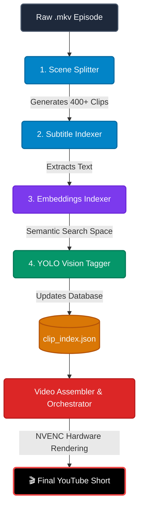

<div align="center">
  

  # 🤖 Automated YouTube Shorts AI Pipeline
  
  [](#)
  [](#)
  [](#)
  [](#)
  [](#)

  **A fully automated, AI-driven pipeline that converts long-form video episodes into highly engaging, auto-captioned, and character-tagged YouTube Shorts.**
</div>

---

## 🌟 Overview

This repository houses an advanced video automation pipeline designed to curate and render short-form content at scale. By leveraging computer vision and natural language processing, the system intelligently identifies scenes, extracts dialogue, semantically maps conversations, and spatially tags characters on screen—all before rendering the final hardware-accelerated video.

### 🧠 Core Capabilities & AI Stack
- **Intelligent Scene Splitting:** Uses `PySceneDetect` (via OpenCV) to analyze frame differences and losslessly cut full-length episodes exactly on camera cuts.
- **Dialogue Extraction:** A custom matching algorithm cross-references `.srt` subtitle files with scene timecodes to perfectly assign the exact spoken dialogue to each micro-clip.
- **Semantic Vibe-Search:** Uses Hugging Face's `clip-ViT-B-32` model to create dense 512-dimensional vector embeddings of the dialogue. This allows the orchestrator to dynamically pull clips based on abstract concepts, "vibes", or topics.
- **Computer Vision Character Recognition:** Employs a custom-trained **YOLOv8** model running on PyTorch to scan frames and tag which characters (e.g., Rick, Morty, Summer) are physically present in the scene.
- **Hardware-Accelerated Rendering:** Powered by FFmpeg with NVIDIA NVENC support (`h264_nvenc`) to assemble, crop, and render 1080p Shorts natively on the GPU, dropping render times from minutes to seconds.

---

## 🛠️ Pipeline Architecture

The pipeline is split into two massive phases: **Data Ingestion** (Steps 1-4) and **Video Generation** (The Orchestrator). 

All extracted metadata is continuously funneled into a central `clip_index.json` database, which serves as the "brain" for the automated editor.



---

## 🚀 How It Works: The Ingestion Phase

To ingest a new full-length episode into the AI's "memory", activate your virtual environment and run the pipeline sequence below:

### Step 1: Chop the Episode into Scenes
The first step is completely breaking down a 20-minute episode into usable, bite-sized components. `scene_splitter.py` analyzes the pixels of every frame to detect camera angle changes, and triggers an FFmpeg cut. 
- **Input:** A raw `.mkv` or `.mp4` episode file.
- **Output:** Hundreds of perfectly cut `.mp4` scene files saved into a `split_clips` folder, along with a JSON manifest of their exact timestamps.
```powershell
.\venv\Scripts\python scripts/scene_splitter.py "clips/rick_and_morty/Episode/episode.mkv" --output "clips/rick_and_morty/" --prefix "s5e6"
```

### Step 2: Auto-Tag Subtitles (Database Creation)
Now that we have hundreds of mute video clips, the AI needs to know what is happening in them. This script reads the master subtitle `.srt` file, compares it to the timecodes from Step 1, and assigns the text to the correct video clip.
- **Output:** The clips are officially registered into the master `clip_index.json` database. They are tagged with their Season, Episode, Filepath, and exact spoken dialogue.
```powershell
.\venv\Scripts\python scripts/clip_indexer_subtitles.py --manifest "clips/rick_and_morty/Episode/split_clips/manifest.json" --srt "subtitles/episode.srt" --show "rick_and_morty"
```

### Step 3: Generate Semantic Embeddings (NLP)
A massive upgrade to the database. The AI reads the dialogue assigned to every single clip and runs it through a Hugging Face `SentenceTransformer` model. 
- **Output:** It appends a massive mathematical array (an embedding) to the database for every clip. This unlocks the ability to search your video clips by context rather than just exact keyword matches! *(Note: Set `$env:CUDA_VISIBLE_DEVICES="-1"` if PyTorch hits architecture limits on your specific GPU).*
```powershell
.\venv\Scripts\python scripts/clip_indexer_embed.py
```

### Step 4: YOLO Vision Tagging (Computer Vision)


Finally, the script loads a specialized YOLOv8 object detection model. It physically opens every single video clip, looks at the frames, and detects which characters are on screen.
- **Output:** Updates the `characters` array in `clip_index.json` (e.g. `['Rick', 'Morty']`), allowing the orchestrator to filter clips by who is currently standing in the scene!
```powershell
.\venv\Scripts\python scripts/clip_indexer_yolo.py --weights yolo_wt/20epochs.pt
```

---

## 🎬 How It Works: The Generation Phase

Once the clips are safely resting in `clip_index.json`, the real magic begins. 

### The Orchestrator (`process_queue.py`)
This is the automated director. You provide it with a topic queue (like "Rick's best insults"). It queries the embeddings space and the YOLO tags in `clip_index.json` to find the 5 or 6 most relevant micro-clips to fit the theme. 

### The Assembler (`assembler.py`)
Once the Orchestrator picks the clips, it hands them to the Assembler. The Assembler:
1. Resizes the horizontal 16:9 clips into vertical 9:16 Shorts format (blurring the background).
2. Uses Text-to-Speech (TTS) to generate voiceovers if needed.
3. Automatically burns stylized captions onto the screen.
4. Uses FFmpeg's `h264_nvenc` to stitch the video fragments together and render the final 60-second video entirely on the GPU.

---

## ⚙️ Hardware Requirements
- **OS:** Windows 11
- **GPU:** NVIDIA RTX 5060 (or better) with up-to-date Game Ready or Studio Drivers. (CUDA acceleration heavily utilized across the stack).
- **Dependencies:** FFmpeg must be installed globally and added to the System PATH with `h264_nvenc` support.

---
<div align="center">
<i>Built with ☕ and ❤️ for Automated Content Creation.</i>
</div>
